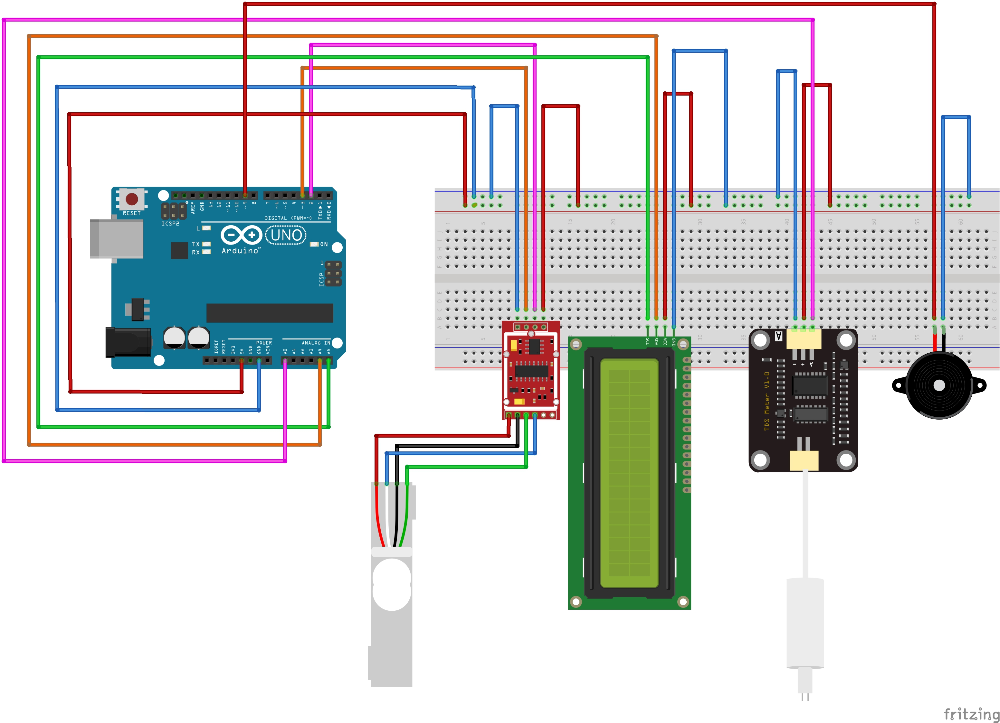
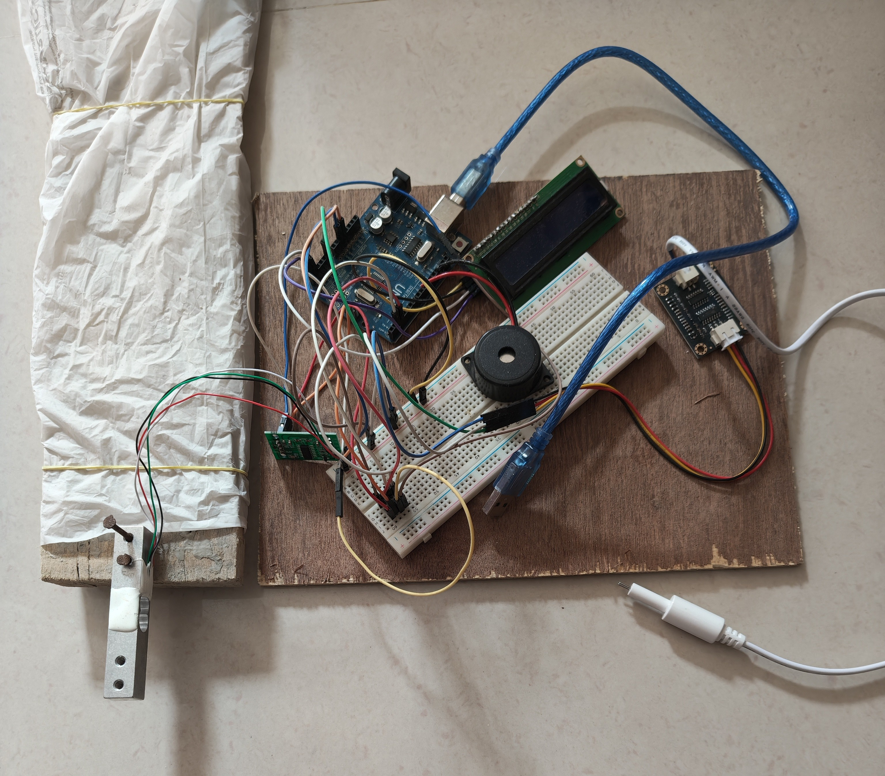

# 💧 Smart IV Concentration and Level Monitoring System

## 📌 Project Overview

A real-time **Smart IV Concentration and Level Monitoring System** built using **Arduino UNO** that monitors the **concentration of IV fluid (TDS in ppm)** and the **remaining IV fluid level (weight)**.

The system uses a **TDS sensor** to measure dissolved solids concentration and a **load cell with HX711 amplifier** to monitor the weight of the IV bottle. The measured values are continuously processed by the Arduino and displayed on a **16×2 I2C LCD**.

An **automatic buzzer alert system** provides warnings when the IV fluid level becomes low or nearly empty, or when the measured TDS value falls outside the defined safe range.

The project is designed as a smart biomedical monitoring solution to reduce manual monitoring effort and provide timely alerts during IV fluid administration.

## 🎯 Project Highlights

- Real-time IV fluid concentration monitoring using TDS sensor
- IV fluid level measurement using load cell and HX711 amplifier
- Weight-based estimation of remaining IV fluid
- Continuous display of weight and TDS values on 16×2 I2C LCD
- Automatic buzzer alerts for low and nearly empty IV levels
- Detection of low and high TDS conditions
- Predefined safe operating range for TDS monitoring
- Arduino-based real-time processing and monitoring
- Simple and low-cost prototype for biomedical monitoring

## ⚙️ System Features

### 💧 IV Concentration Monitoring
- TDS sensor measures dissolved solids concentration in ppm
- Real-time TDS value processing by Arduino UNO
- Safe concentration range defined as 700–1000 ppm
- Identifies low and high TDS conditions

### ⚖️ IV Fluid Level Monitoring
- Load cell measures the weight of the IV bottle
- HX711 amplifier interfaces the load cell with Arduino
- Remaining IV level is estimated from the measured weight
- Detects low and nearly empty IV conditions

### 🖥️ Real-Time Display
- 16×2 LCD with I2C interface
- Displays current IV weight in grams
- Displays TDS concentration in ppm
- Shows system status such as SAFE, LOW, HIGH, or EMPTY

### 🔔 Alert Mechanism
- Continuous buzzer alert when IV level is nearly empty
- Beep–pause alert when IV level is low
- Alert when TDS falls below the safe range
- Alert when TDS exceeds the safe range

### 🔄 Real-Time Monitoring
- Continuous sensor readings
- Automatic processing and threshold comparison
- Immediate visual and audible status indication

## 🛠️ Components Used

- Arduino UNO
- 16×2 LCD Display with I2C Module
- TDS Sensor Module & Probe
- HX711 Load Cell Amplifier
- Load Cell (Weight Sensor)
- Active Buzzer
- Breadboard
- Jumper Wires

## 📐 Component Specifications

### 🔷 Arduino UNO
- Main microcontroller of the system
- Processes TDS and load-cell measurements
- Controls the LCD display and buzzer alerts
- Provides real-time monitoring and threshold-based decision making

### 💧 TDS Sensor Module & Probe
- Measures the concentration of dissolved solids in the IV fluid
- Provides an analog output to the Arduino
- TDS value is represented in ppm
- Connected to Arduino analog input A0

### ⚖️ Load Cell
- Measures the weight of the IV bottle
- Used to estimate the remaining IV fluid level
- Connected to the HX711 load cell amplifier

### 🔷 HX711 Load Cell Amplifier
- Interfaces the load cell with the Arduino UNO
- Provides amplified digital measurement data
- Uses DT and SCK connections for communication with the Arduino

### 🖥️ 16×2 I2C LCD
- Displays real-time IV weight
- Displays TDS concentration in ppm
- Displays system status such as SAFE, LOW, HIGH, or EMPTY
- Uses the I2C interface for communication

### 🔔 Active Buzzer
- Provides audible alerts for abnormal conditions
- Used for low and nearly empty IV level warnings
- Also provides alerts for abnormal TDS values

### 🔌 Breadboard & Jumper Wires
- Used for prototyping and connecting the system components
- Provides temporary circuit connections during development

## 📐 Monitoring Thresholds

### 💧 TDS Thresholds
- **Safe TDS Range:** 700–1000 ppm
- **Low TDS:** < 700 ppm
- **High TDS:** > 1000 ppm

### ⚖️ IV Level Thresholds
- **Full IV Level:** ~500–550 g
- **Low IV Level:** ≤ 25% remaining (~130 g)
- **Empty IV Level:** ≤ 40 g

### 🔔 Alert Conditions
- **Continuous Buzzer:** IV level ≤ 40 g
- **Beep–Pause Buzzer:** IV level ≤ 25% remaining
- **Low TDS Alert:** TDS < 700 ppm
- **High TDS Alert:** TDS > 1000 ppm

## 🖥️ Code

All code files are available inside the [`Smart_Saline/`](Smart_Saline/) directory:

- [`Smart_Saline.ino`](Smart_Saline/Smart_Saline.ino) — Arduino sketch for uploading to the board.
- [`Smart_Saline.txt`](Smart_Saline/Smart_Saline.txt) — Code in text format for quick viewing.

**Libraries used:**

Install via Arduino Library Manager:

- LiquidCrystal_I2C
- Wire

Core firmware functions:

- HX711 load-cell data acquisition
- IV weight calculation
- TDS sensor reading
- TDS value filtering and conversion
- IV level calculation
- TDS threshold evaluation
- LCD status display
- Buzzer alert control

## 🔌 Circuit & Design Diagrams

### 🧩 Breadboard Circuit

## 🖼️ Project Demonstration

### 📸 Demo Photo

### 📽️ Demo Videos

#### 🎥 Project Demo 1
[📺 Watch Project Demo 1 on Google Drive](https://drive.google.com/file/d/17KhdNzsEV-9ynxcVSdL8pjeCjXEBSKF8/view?usp=drive_link)

#### 🎥 Project Demo 2
[📺 Watch Project Demo 2 on Google Drive](https://drive.google.com/file/d/1Lse1V8-8wUvK9UhsyIIqJH6DymYFoi6Z/view?usp=drive_link)

You can also find both demonstration videos inside this repository:
- [`Project-Demo-1.mp4`](Project-Demo-1.mp4)
- [`Project-Demo-2.mp4`](Project-Demo-2.mp4)

## 📊 Results & Observations

| Parameter | Expected Result | Observed Result |
| TDS Sensor | 900 ppm | ~875 ppm |
| HX711 Load Cell | 500 g | ~550 g |

The prototype successfully demonstrated real-time monitoring of both **IV fluid concentration** and **IV fluid level**.

The TDS sensor provided a measured value of approximately **875 ppm**, while the HX711 load-cell system measured approximately **550 g** during testing.

The LCD continuously displays the measured weight and TDS concentration, while the buzzer provides alerts according to the configured monitoring thresholds.

## 📄 How to Use

1. Connect all components according to the circuit diagram
2. Place the IV bottle on the load cell
3. Connect the Arduino UNO to a USB / 5V power supply
4. Upload the `Smart_Saline.ino` code to the Arduino UNO
5. Allow the system to initialize and perform the load-cell offset calibration
6. Monitor the IV weight and TDS concentration on the LCD
7. Observe the displayed status for SAFE, LOW, HIGH, or EMPTY conditions
8. The buzzer automatically provides an alert when a defined threshold is exceeded

## 🚀 Future Improvements

- IoT integration for remote IV monitoring
- Mobile alerts for real-time notifications
- Wireless data transmission to hospital systems
- Monitoring of multiple IV bottles simultaneously
- Improved sensor accuracy for better performance

## 🧑‍💻 Author

**Argha Kumar Dhar**  
GitHub: https://github.com/argha-kumar-dhar

## 📜 License

This project is open-source under the [MIT License](LICENSE).